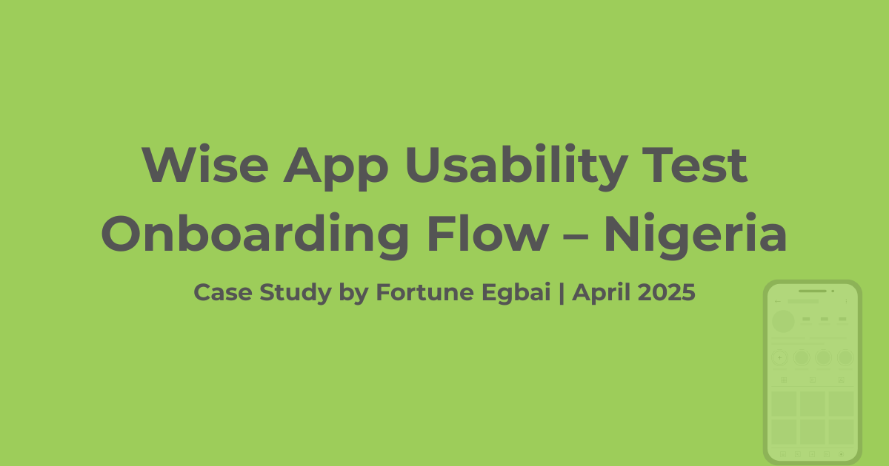
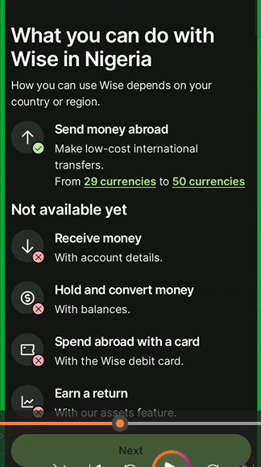
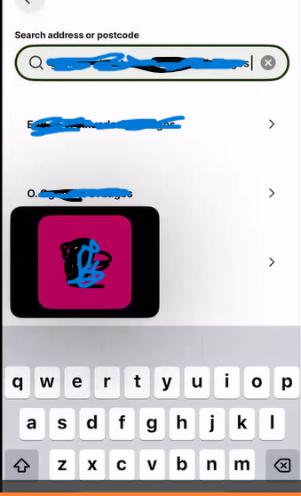
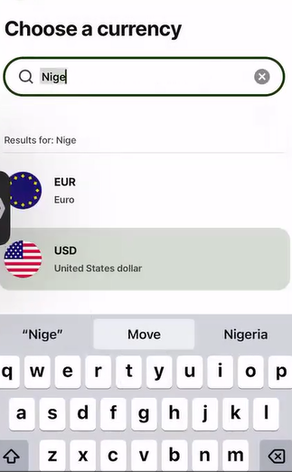
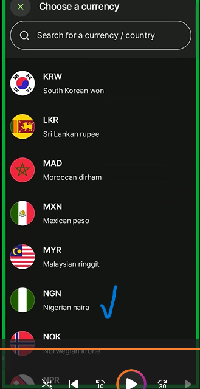
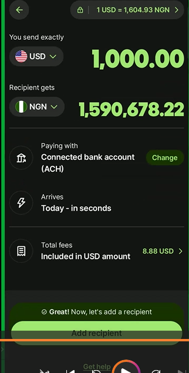

# Wise App Usability Test: Onboarding Flow for Nigerian Users

## Executive Summary
I independently conducted a usability test on the Wise app’s onboarding and KYC flow, focused on Nigerian users. My goal was to evaluate how clearly and smoothly new users could sign up, verify their identity, and understand the product’s limitations in the Nigerian market.

While testers praised the app’s clean design and speed, they encountered significant friction around unavailable features, confusing currency options, and address search issues. This case study outlines key findings and data-driven recommendations to improve the onboarding experience and local relevance for Nigerian users.

**_Disclaimer_**:
>**_This usability test was independently conducted on the Wise app. All brand assets used are for educational and illustrative purposes only. Recordings were used strictly for internal analysis and were not shared, in line with participant privacy agreements._**

##  Background
Nigeria is one of Africa’s largest fintech markets, with annual remittance inflows around $20 billion (World Bank, 2023). Nigerian users expect fintech apps like Wise to support local currency (Naira) for both sending and receiving funds, as well as feature parity with other markets.
But limitations in local functionality can leave users feeling excluded or misinformed, undermining trust and adoption.

>**_This usability test was conducted in April 2025 as part of a product management project. Documentation and publication were finalized afterward._**

## Problem Statement
Can Nigerian users successfully complete Wise’s onboarding flow and leave with a clear, positive understanding of what they can and cannot do with the app?

## Testing Objectives & Success Metrics
I designed this usability test to understand whether users could:

- Install and launch the app easily

- Complete sign-up and KYC without external help

- Understand limitations in Wise’s services for Nigeria

Measured by:

- Task completion rates

- User comments and emotional reactions

- Points of hesitation or confusion

## Methodology
- Type: Remote, moderated sessions

- Platform: Zoom (participants shared their screens)

- Technique: Think-aloud protocol

- Devices: Smartphone testing (Android/iOS)

- Recording: Sessions recorded solely for analysis (not shared publicly)

**_Ethical Considerations_**:
>**_All participants provided informed consent to be recorded. No personal data or identifying details are shared in this case study._**

## Participants
| Participant | Age | Occupation   | Fintech Familiarity |
| ----------- | --- | ------------ | ------------------- |
| A           | 24  | Realtor      | High                |
| B           | 28  | Tech worker  | High                |
| C           | 37  | Geoscientist | Medium              |
- Participant details are listed anonymously to maintain privacy
- All were Nigerian males, comfortable with digital tools

- All successfully completed onboarding and KYC

## User Flow Tested
Below are the 16 steps observed in the onboarding journey.
| Step | Description                                   |
| ---- | --------------------------------------------- |
| 1    | Find and install app                          |
| 2    | Welcome screen                                |
| 3    | Sign-up page                                  |
| 4    | Enter email                                   |
| 5    | Email confirmation                            |
| 6    | Select account type                           |
| 7    | Choose country                                |
| 8    | What you can do with Wise in Nigeria          |
| 9    | Enter verification code                       |
| 10   | Create password                               |
| 11   | Biometrics/passcode setup                     |
| 12   | Fill personal info                            |
| 13   | Enter address (search or manual)              |
| 14   | Confirm address                               |
| 15   | Reach dashboard                               |
| 16   | Currency selection (send & receive)           |

## Detailed Findings & Insights
Below is a summary of usability insights, organized by screen. Each section includes:

- Observed insight → What users did or said

- Identified issue → The problem

- Recommendation → How to fix it

### Step 8: What you can do with Wise in Nigeria

 

**_Observed insight_**:

All three participants showed frustration when reaching a screen that stated “_Not available yet_” for key features like receiving money or accessing a Wise debit card. Two users sighed audibly and asked, “_Why is it not available if it’s a global app?_”

**_Identified issue_**:
- The phrase “_Not available yet_” felt vague and discouraging.

- Users questioned whether Wise was relevant for Nigeria at all.

**_Recommendation_**:
- Provide a clear explanation for unavailable features.

- Include reassuring messaging like:
  “_These features are coming soon to Nigeria. Our team is working to launch them safely and quickly._”

 ### Step 13: Enter address (Search option)

 
**_Observed insight_**:

Two users experienced errors when searching Nigerian addresses. One said:
“_It keeps showing wrong result. How else am I suppose to enter it?_”

**_Identified issue_**:

- Address search returned wrong entries for valid Nigerian addresses.

- Users wasted time before manually typing details.

**_Recommendation_**:
-  Enhance backend address data for Nigerian locales.
-  Or, make “_Enter manually_” the default for Nigerian users.
-  Provide tips like:
“_Try including state or LGA for better results._”

### Step 16a: Currency selection (You Send – Naira not available)

.

**_Observed Insight_**:

Two participants tried to send Naira but couldn’t find it as a sending option. Both asked:
“_So why can’t I send Naira if I’m in Nigeria?_”

**_Identified Issue_**:

Lack of clarity about currency limitations.

**_Recommendation_**:

 Display a note:
“_Sending Naira is currently unavailable. We’re working to expand this option._”

### Step 16b: Currency selection (Recipient Gets – Naira available)

Recipient gets Naira available                                     |  Recipient gets Naira in the dashboard
:----------------------------------------------------------------: |:----------------------------------------:
 |

**_Observed insight_**:

One participant was surprised and relieved that the recipient could receive Naira after sending USD.

**_Identified issue_**:

Users only discover this flexibility late in the flow, causing initial confusion.

**_Recommendation_**:

 Introduce earlier messaging: 
 “_While you can’t send Naira directly, your recipient may still receive funds in Naira if their bank account is in Nigeria._”

 ## Quick Findings Table
| Screen   | Issue                        | Severity | Recommendation                             |
| -------- | ---------------------------- | -------- | ------------------------------------------ |
| Step 8   | Unclear unavailable features | High     | Add explanatory, region-specific messaging |
| Step 13  | Address search failures      | High     | Improve database, prioritize manual input  |
| Step 16a | Naira not available to send  | Medium   | Add tooltip explaining limitation          |
| Step 16b | Hidden Naira receive option  | Medium   | Explain earlier in flow                    |

## Key Recommendations
- Localization: Create region-specific onboarding flows for countries with feature gaps.

- Transparency: Proactively communicate unavailable services rather than letting users discover them by accident.

- Data enhancements: Improve Nigerian address search data or simplify manual input.

- Expectation management: Set realistic expectations about what users can and cannot do from day one.

## Personal Reflection & Learnings
This usability test taught me:

- Even small wording choices (like “_Not available yet_”) can seriously impact user trust.

- Users expect local relevance, especially in global fintech products.

- It’s crucial to combine UX observations with business context to craft better product strategies.

If I ran this study again, I would:

- Test with a more diverse group (female participants, broader age range)

- Measure precise time-on-task to pinpoint friction areas and improve onboarding speed

- Validate any proposed copy changes through A/B tests

This project helped me connect my business, sales, customer service, and analytical skills into practical product insights, always keeping real users at the center.

##  What’s Next?
I’m excited to keep exploring:

- How global fintech products adapt to local markets

- The intersection of product design and business viability

- More usability testing to refine my product management skills

If you’re a recruiter, PM, or hiring manager who values product thinking, UX, customer empathy, and strong analytics, I’d love to connect and share ideas.

## Resources

- [Download full Google Slides report here](./docs/Wise_Usability_Test_Report.pdf)
- [Browse all raw onboarding screenshots here](./images/)

