# Where Wise Leaves Nigeria-Based Users Guessing: A Fintech Signup and Activation Usability Study

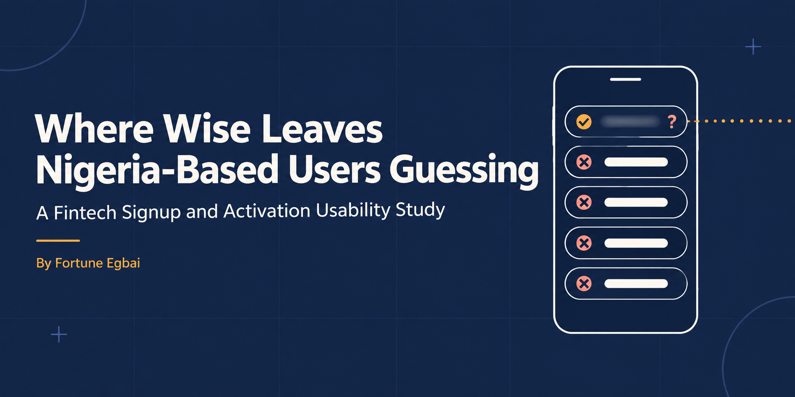

## Contents

- [Executive Summary](#executive-summary)
- [Problem Statement](#problem-statement)
- [Background](#background)
- [Disclaimer and Ethical Considerations](#disclaimer-and-ethical-considerations)
- [Methodology](#methodology)
- [Key Insights](#key-insights)
  - [Findings and Severity](#findings-and-severity)
- [Product Decisions and Recommendations](#product-decisions-and-recommendations)
  - [Decision Matrix](#decision-matrix)
- [Metrics and Experimentation Plan](#metrics-and-experimentation-plan)
  - [Metrics Dashboard](#metrics-dashboard)
  - [Experiment Plan](#experiment-plan)
- [Business Impact](#business-impact)
- [Study Constraints and Next Steps](#study-constraints-and-next-steps)
- [Resources](#resources)

## Executive Summary
Wise's signup flow names every feature users in Nigeria can't use, but it never states outright whether they can send money from Naira. In three moderated sessions I ran with Nigeria-based participants in April 2025, all three completed signup and profile setup without outside help, and participants praised the flow's speed and clean design. The one stall before the send step came at address entry, where search returned wrong results for two of the three participants before they switched to manual entry. The larger mismatch came at the send step, where all three searched for Naira as a sending currency and couldn't find it, and two of them went no further. Nothing earlier had told them it wasn't there, since the Step 8 eligibility screen described sending as available "From 29 currencies to 50 currencies" without naming any of them. One participant later found that sending USD would let his recipient receive Naira. Because sending abroad is the only feature Wise lists as available in Nigeria, this confusion sits on the one path where Wise earns from these users. In priority order, Wise should route the Naira question at the send step by pointing users to Naira as a recipient currency, answer the same question on the Step 8 screen before signup ends, and make manual entry the default for Nigeria addresses.

## Problem Statement
Wise does not offer Naira as a sending currency. As of September 2026, the [Wise Help Centre](https://wise.com/help/articles/2571907/what-currencies-can-i-send-to-and-from) lists NGN only among the currencies users can send to, for recipients in Nigeria, and the app showed the same limit in April 2025, when a search for "Nige" in the sending currency list returned only EUR and USD. Wise can't change that limit from inside the onboarding flow, but it does decide how and when the flow tells users about it, and that is where this study found the problem.

The affected segment is Nigeria-based first-time Wise users trying to send money, meaning new users who select Nigeria as their country of residence at Step 7. Before their account exists at Step 10, the Step 8 eligibility screen shows them what Wise offers in Nigeria. It names each unavailable feature on its own line, but for the one available feature, sending money abroad, it gives the currencies only as a count. Signup therefore ends without answering the question all three participants brought with them, whether they could send from Naira. The first concrete answer came as a failed search at the send step, on the activation path. That is exactly where the confusion set in, and where two of the three participants stopped.

A smaller issue came up earlier, at the Step 13 address step, which follows account creation. Search returned wrong results for valid Nigeria addresses in two of three sessions, and both participants lost time before switching to manual entry.

The study asked whether Nigeria-based first-time users could finish Wise's signup and send flow with an accurate picture of what they could and could not do.

A resolved flow would tell these users which currencies they can send from before signup ends, point them to Naira as a recipient currency without a failed search, and let them enter their address without first losing time on search results that don't match. Each outcome is defined and measured in the [Metrics and Experimentation Plan](#metrics-and-experimentation-plan).

## Background
Wise is a money transfer app for Android and iOS. Before signup ends, the app tells users that how they can use Wise "depends on your country or region." For a user who selects Nigeria as their country of residence, the Step 8 screen lists one available feature, "Send money abroad." Four more appear under the heading "Not available yet," "Receive money," "Hold and convert money," "Spend abroad with a card," and "Earn a return." Naira is not among the sending currencies, as set out above.

This study follows the Wise app on a smartphone from install to the first transfer quote, across 16 numbered steps that the rest of this case study refers to by number. Steps 1 to 3 cover acquisition, from finding the app to its welcome screen and sign-up page. Steps 4 to 10 make up signup, which ends when the account is created at Step 10. Steps 11 to 14 set up the profile with biometrics or a passcode, personal details, and a home address. Steps 15 to 16bb begin the path toward activation, from the dashboard through the "Send money" button to currency selection and a transfer quote.

This project was completed as part of a structured product management program. The sessions ran in April 2025.

## Disclaimer and Ethical Considerations
I conducted this study independently. It is not affiliated with Wise, and Wise did not commission or review it. All participants provided informed consent to be recorded. Recordings were used strictly for internal analysis and were not shared, in line with participant privacy agreements. The Wise app screenshots in this case study are still frames from those recordings, used only to illustrate and support the analysis, with participants' personal details covered. Participants are referred to only by code (P1 to P3). No personal data or identifying details are shared in this case study.

## Methodology
I ran three one-on-one, moderated usability sessions on Zoom in April 2025, with each participant sharing their screen from their own smartphone. Moderated think-aloud fits this study's question because it captures what a person expected at the moment a screen fails to deliver it, which funnel data can't show.

The participants came from my own network, and they had a lot in common. All three were Nigeria-based Nigerian men who were highly familiar with fintech apps, and none had a Wise account before his session. That experience cuts both ways. When people who use fintech apps regularly get confused, the flow is a more likely cause than unfamiliarity, but three such participants leave open how women and less experienced users would handle the same screens.

| Participant | Age | Occupation | Fintech familiarity | Phone platform |
| --- | --- | --- | --- | --- |
| P1 | 24 | Realtor | High | iOS |
| P2 | 28 | Incoming cybersecurity student | High | iOS |
| P3 | 37 | Geoscientist | High | Android |

I opened each session with an introduction script and background questions about the participant's experience with remittance apps, then asked him to work through the flow one step at a time while thinking aloud. I encouraged participants to keep talking but did not solve any step for them. At the Step 15 dashboard, all three tapped "Send money," which opened the Step 16 currency selector. P1 and P2 chose to stop after the Step 16a currency search because Naira wasn't available to send, while P3 went on to a transfer quote at Step 16bb. No session went past the Add recipient step, so no money moved, and no ID was uploaded, which means identity verification was not tested. Each session closed with follow-up questions about the experience. The exact task wording was not preserved.

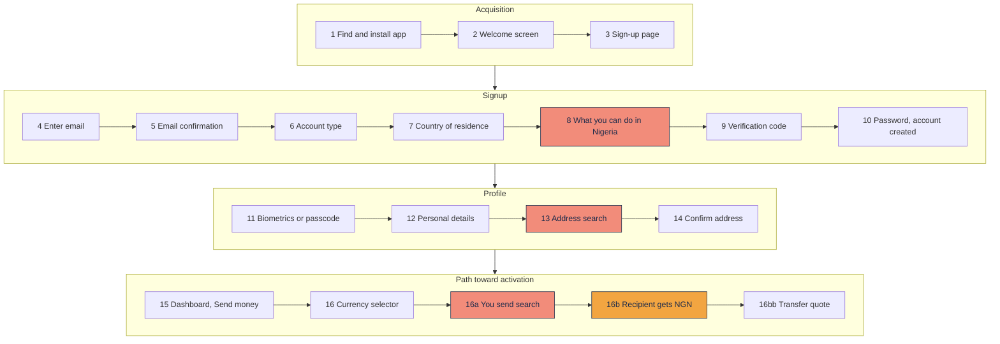
```mermaid
flowchart TB
    accTitle: The Wise flow studied, from install to the first transfer quote
    accDescr: Four stages in order. Acquisition covers Steps 1 to 3. Signup covers Steps 4 to 10 and ends with account creation. Profile covers Steps 11 to 14. The path toward activation covers Steps 15 to 16bb. Friction points are Step 8, the eligibility screen, Step 13, address search, and Step 16a, the sending currency search. Step 16b, where Naira appears as a recipient currency, is marked as a late discovery.

    subgraph ACQ["Acquisition"]
        direction LR
        S1["1 Find and install app"] --> S2["2 Welcome screen"] --> S3["3 Sign-up page"]
    end

    subgraph SIGN["Signup"]
        direction LR
        S4["4 Enter email"] --> S5["5 Email confirmation"] --> S6["6 Account type"] --> S7["7 Country of residence"] --> S8["8 What you can do in Nigeria"] --> S9["9 Verification code"] --> S10["10 Password, account created"]
    end

    subgraph PROF["Profile"]
        direction LR
        S11["11 Biometrics or passcode"] --> S12["12 Personal details"] --> S13["13 Address search"] --> S14["14 Confirm address"]
    end

    subgraph ACT["Path toward activation"]
        direction LR
        S15["15 Dashboard, Send money"] --> S16["16 Currency selector"] --> S16a["16a You send search"] --> S16b["16b Recipient gets NGN"] --> S16bb["16bb Transfer quote"]
    end

    ACQ --> SIGN --> PROF --> ACT

    classDef friction fill:#F28C7A,stroke:#1B2A4A,color:#1B2A4A
    classDef late fill:#F2A541,stroke:#1B2A4A,color:#1B2A4A
    class S8,S13,S16a friction
    class S16b late
```
*Figure 1: The flow studied, from install to the first transfer quote. Coral marks friction at Steps 8, 13, and 16a. Amber marks Step 16b, where Naira appeared as a recipient currency.*

During each session I noted points of confusion, errors, and successes, then reviewed the recordings afterwards to check what each participant said and did at those points. No timings or post-task ratings were recorded.

Three sessions show that a problem exists and recurs, and most plausibly why, but not how often it occurs among Wise users, so findings are reported as counts. Any rate in the [Metrics and Experimentation Plan](#metrics-and-experimentation-plan) is a measure proposed for Wise's own data, not a result of this study.

The app may have changed since April 2025. The session recordings were later lost to a corrupted drive, and my session notes did not survive, so the findings rest on still frames taken from the recordings, the write-up prepared after the sessions, and my own account of what happened. Outside facts were checked in September 2026, and present-tense descriptions of the app refer to it as studied.

## Key Insights
Most of the flow worked. All three participants got from install to the dashboard without help, and participants praised its speed and clean design, so the two findings below sit inside an otherwise smooth flow.

### Signup names every unavailable feature but leaves the Naira question for the send step

At Step 8, before the account exists, Wise shows a new user what they can do in Nigeria. All three participants were disappointed at this screen. Two sighed audibly. One of them asked, "Why is it not available if it's a global app?", and the other raised the same question in his own words. The screen is specific about the limits and leaves the currency details for the one available feature behind links. Under "Send money abroad," it says "Make low-cost international transfers" and gives the currencies as a count, "From 29 currencies to 50 currencies," with each count linked. Nothing on the screen itself says which currencies those are, and none of the three participants opened the links. For users whose first question is whether they can send from Naira, a count is not an answer, so all three reached the end of signup with that question still open.

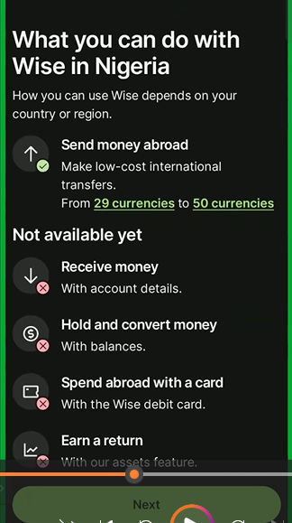

*Figure 2: The Step 8 eligibility screen shown to a Nigeria resident.*

The answer came at the send step. After tapping "Send money" on the dashboard, all three searched for Naira in the "You send" currency list, and a search for "Nige" returned EUR and USD with no explanation. One participant asked, "So why can't I send Naira if I'm in Nigeria?", and the other two raised the same question in their own words. P1 and P2 went no further, and each said he would not keep using the app. The limit belongs to Wise's product scope, since Naira isn't offered as a sending currency, but the flow decided how users met it, and they met it as a failed search.

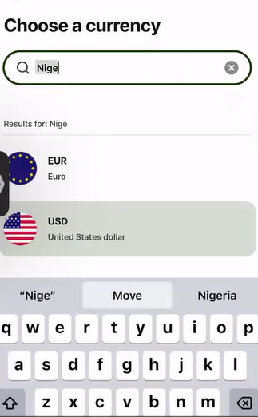

*Figure 3: The Step 16a sending currency search.*

P3 kept going. He picked USD as his sending currency, found NGN in the "Recipient gets" list at Step 16b, and reached a quote at Step 16bb showing his recipient receiving Naira. He was surprised and relieved, which most plausibly means the recipient route meets the need behind the question, even though it doesn't answer the question as asked. The flow showed that route only after the failed search, and only to the one participant who didn't stop there. Whether he could have funded a USD transfer was not tested.

Recipient gets Naira available                                     |  Transfer quote with NGN as recipient currency
:----------------------------------------------------------------: |:----------------------------------------:
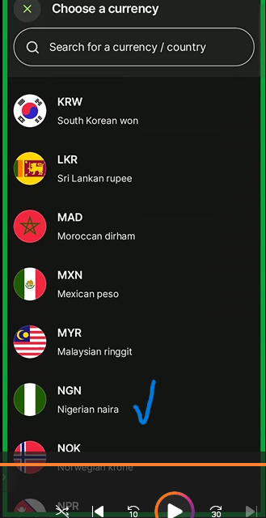 |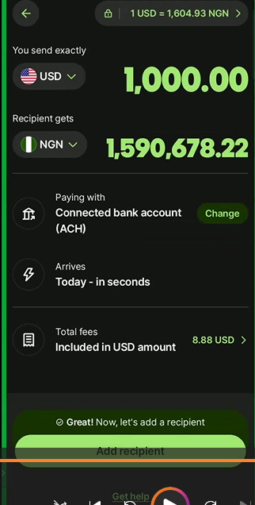

*Figure 4: The Step 16b recipient currency list (left) and the Step 16bb transfer quote (right). The check mark was added for this case study, and the payment method on the quote is an app default.*

Taken together, the three screens point to one change of approach. The Step 8 screen should answer the Naira question on the screen itself, keeping the links for anyone who wants the full currency lists, and the send step should point users to Naira as a recipient currency before a search for it can fail.

### Address search returned wrong results for two participants' Nigeria addresses and cost them time

At Step 13, the profile asks for a home address through a field labeled "Search address or postcode." For two of the three participants, a search for their home address returned wrong results. One of them said, "It keeps showing wrong result. How else am I suppose to enter it?" Both lost time before switching to manual entry, then carried on without help, which makes this a smaller issue than the send step. The most plausible cause is thin coverage of Nigeria addresses in the search data. Making manual entry the default for Nigeria addresses would take that detour out of the flow.

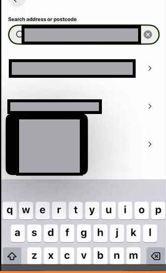

*Figure 5: The Step 13 address search, with personal details covered.*

### Findings and Severity

The severity ratings use a five-level scale adapted from [Nielsen Norman Group's guidance on rating usability problems](https://www.nngroup.com/articles/how-to-rate-the-severity-of-usability-problems/), which weighs how often a problem occurs, how hard it is to get past, and whether it keeps coming back. Critical means the issue stops a participant from completing a task or would cause a wrong transfer. High means it sends someone down a wrong path, forces a restart, or causes a long stall. Medium means hesitation or a small error the participant gets past quickly, Low means a wording problem with no effect on progress, and Not rated covers questions of product scope. Nothing in this study is rated Critical. P1 and P2 stopped at the send step, but they stopped at a limit of Wise's product scope, and nothing in the sessions shows whether a clearer flow would have carried them through to a transfer. Priority reflects the decision each finding feeds, not severity alone.

| Screen or Step | Observation | Root Cause | Severity | Recommended Decision | Priority |
| --- | --- | --- | --- | --- | --- |
| Step 8, eligibility screen (Figure 2) | 3 of 3 were disappointed. 2 of 3 sighed and asked why features were unavailable. None opened the currency links | The screen names each unavailable feature but gives the sending currencies only as a linked count | Medium | Answer the currency question at Step 8 | High |
| Step 13, address search (Figure 5) | 2 of 3 got wrong results for their home addresses and lost time before manual entry | Search data most plausibly covers Nigeria addresses poorly | Medium | Default to manual address entry for Nigeria addresses | Medium |
| Steps 16a and 16b, currency selection (Figures 3 and 4) | 3 of 3 searched for Naira to send and found EUR and USD. 2 of 3 stopped. 1 of 3 found NGN as a recipient currency | The Naira limit is first disclosed through a failed search, and the recipient route appears only after it | High | Route the Naira question at the send step | High |

## Product Decisions and Recommendations

In both findings, the flow gave its answer only after something failed. Naira appeared as a recipient currency once the sending search came up empty, and participants reached manual address entry once search returned wrong results. Each decision below moves the answer ahead of the failure, within what Wise controls in the flow. Decisions 1 and 2 answer the same Naira question at two points, and they stay separate because each changes a different stage of the funnel and carries its own risk.

### 1. Route the Naira question at the send step

- **Decision.** For users with Nigeria as their country of residence, Wise should show a note at the top of the "You send" list, before any search, pointing them to Naira as a recipient currency, with wording to test such as "Naira isn't available to send from. To pay someone in Naira, choose NGN under Recipient gets."
- **Rationale.** All three participants searched for Naira here (Figure 3), so the answer would sit where users act on the question. Relying on Step 8 alone would still leave a failed search for anyone who skims that screen or returns later. Preselecting NGN as the recipient currency was also considered, but it would assume every user is sending to Nigeria.
- **Expected impact.** The share of these users who open the "You send" list and reach a transfer quote in the same session should rise.
- **Trade-offs.** The note would only help people who have money in another currency, such as US dollars, that they can pay with, and this study didn't check whether participants did. Anyone who doesn't could follow the note all the way to a transfer quote and then get stuck when it's time to pay.
- **Priority.** High, because this is where two of three participants stopped, on the one path where Wise earns from this segment.

### 2. Answer the currency question at Step 8

- **Decision.** Wise should answer the Naira question in words on the Step 8 screen, pointing to Naira as a recipient currency, and keep the two currency links for anyone who wants the full lists. Wording to test could be "You can't send from Naira, but you can choose Naira as the currency your recipient gets."
- **Rationale.** None of the three participants opened the links (Figure 2), so the answer needs to sit on the screen they already read. A note at the send step alone would reach users only after they had created an account and set up a profile.
- **Expected impact.** Fewer of these users should search for Naira in the "You send" list after signup, with account creation after Step 8 as the guardrail.
- **Trade-offs.** Some users Wise can't serve might leave before creating an account, which would lower signups from this segment.
- **Priority.** High, since a change to the wording on one screen reaches everyone who selects Nigeria at Step 7. It ranks second because the stops happened at the send step, not here.

### 3. Default to manual address entry for Nigeria addresses

- **Decision.** Wise should open Step 13 on manual entry for users with Nigeria as their country of residence, with address search kept as an option.
- **Rationale.** Both participants who got wrong results finished the step by typing their address in (Figure 5). Tips such as "Try adding state or LGA" would still send users back to the same search. Improving Nigeria address data was also considered and held back. Two sessions can't show how often search fails, but with manual entry as the default, Wise could track how often users who still choose search find their address, and decide on better data from there.
- **Expected impact.** Users should get through the address step faster, measured as the median time from opening the step to confirming the address.
- **Trade-offs.** Typed addresses may be less consistent than matched ones, which could create more follow-up where Steps 7 and 13 warn that proof of address may be required.
- **Priority.** Medium, because search slowed two participants without stopping either, and the change is low effort.

What the Step 8 currency links showed, and whether participants could have funded a USD transfer, stay open and are covered in [Study Constraints and Next Steps](#study-constraints-and-next-steps).

### Decision Matrix

Expected impact names a direction only, because this study produced no baseline, and the size of change each decision would need to show is set in the [Metrics and Experimentation Plan](#metrics-and-experimentation-plan). Effort is a relative estimate, since no engineering estimate exists. Confidence follows [Intercom's RICE tiers](https://www.intercom.com/blog/rice-simple-prioritization-for-product-managers/), where Medium means some evidence supports the decision but its impact remains uncertain.

| Decision | Expected Impact | Effort | Confidence Level | Key Trade-off |
| --- | --- | --- | --- | --- |
| Route the Naira question at the send step | More users in Nigeria who open "You send" go on to reach a transfer quote | Medium, since the note would show only to users in Nigeria but changes send screens that customers in every country use | Medium, because P3's relief most plausibly shows the recipient route meets the need, but funding was not tested | Users with no other currency to pay with may still get stuck, just later, at payment |
| Answer the currency question at Step 8 | Fewer users search for Naira in "You send" after signup | Low, since it only changes the words on one screen, and only for users in Nigeria | Medium, because all three read the screen closely enough to be disappointed, but its effect on later searches is untested | Some users Wise can't serve may leave before creating an account |
| Default to manual address entry for Nigeria addresses | Users get through the address step faster | Low, since it only changes which option the address step opens on, for users in Nigeria | Medium, because manual entry worked for both participants who used it, but how often search fails is unknown | Typed addresses may be less consistent where proof of address is checked |

## Metrics and Experimentation Plan

This study produced no rates, so no metric below has a baseline yet. Wise would measure each one from its own funnel data before launch and set every threshold from that baseline before a test starts. Nigeria-residence users here means new users who selected Nigeria as their country of residence at Step 7.

### Metrics Dashboard

The three KPIs decide whether each decision worked, and the two guardrails must not get worse while they move.

| KPI | Definition | Baseline | Target | Measurement Method |
| --- | --- | --- | --- | --- |
| Send-step quote rate (Decision 1) | Out of all Nigeria-residence users who open the "You send" list, the percentage who reach a transfer quote in the same session | Measured before launch from Wise's funnel data |Rise, confirmed by the A/B test below| Wise's app records when each user opens the list and when they see a quote |
| Post-signup Naira search rate (Decision 2) | Out of all Nigeria-residence users who open the "You send" list after creating an account, the percentage who search for "naira," "ngn," or "nigeria," including partial entries such as "Nige" | Measured before launch from Wise's funnel data |Fall, confirmed by the A/B test below | What users type into the "You send" search box |
| Address step time (Decision 3) | Median time from opening Step 13 to confirming the address at Step 14, for Nigeria-residence users | Measured before launch from Wise's funnel data | Fall larger than its usual week-to-week movement before launch, compared over equal periods| The time each user opens Step 13 and the time they confirm their address|
|Guardrail: account creation after Step 8 (Decision 2) | Out of all Nigeria-residence users who view Step 8, the percentage who create an account at Step 10 | Measured before launch from Wise's funnel data | No drop beyond a limit Wise sets before launch | Wise's records of who sees Step 8 and who goes on to create an account |
| Guardrail: address corrections (Decision 3) | Out of all Nigeria addresses entered manually, the percentage later corrected or rejected when proof of address is checked | Measured before launch from Wise's funnel data | No rise beyond a limit Wise sets before launch | Wise's records of address edits and proof-of-address checks |

Three secondary measures would explain the results without deciding them. For Decision 1, it is the percentage of quotes that become completed transfers, which is where the funding trade-off would show up. For Decision 2, it is first completed transfers per user who viewed Step 8, and for Decision 3, it is how often users who still choose search select a result.

### Experiment Plan

Decisions 1 and 2 would each run as an A/B test, in priority order. Decision 1's test would run first, and Decision 2's would follow with the winning version of Decision 1 shown to both groups, so Wise could tell which change caused each result. Users would be split at random when they first reach the screen being tested, and each would keep seeing the same version for the whole test. Before each test, Wise would set the minimum detectable effect, the smallest change the test is sized to catch, from the measured baseline at 95% confidence and 80% power. Each test would run for at least two full weeks, and longer if this segment needs more time to reach the sample size calculated in advance.

| Test Name | Hypothesis | Control | Variant | Primary Metric | Success Threshold |
| --- | --- | --- | --- | --- | --- |
| Send-step Naira note | If Nigeria-residence users see a note pointing them to Naira as a recipient currency before they search the "You send" list, more of them would reach a transfer quote, because a failed search would no longer be their first answer | The "You send" list as studied | The "You send" list with the note at the top | Send-step quote rate |A statistically significant rise, in a test sized for the minimum detectable effect |
| Step 8 Naira answer | If the Step 8 screen answers the Naira question in words, fewer Nigeria-residence users would search for Naira after signup, because they would reach the send step already knowing | The Step 8 screen as studied | The Step 8 screen with the Naira answer, links kept | Post-signup Naira search rate | A statistically significant fall, in a test sized for the minimum detectable effect, with account creation within its limit | 

For Decision 1, a positive result would be a clear rise in the send-step quote rate, and it would support keeping the note. Wise would then check how many of those quotes became completed transfers, since that is where users without another currency to pay with would drop out. A null result, meaning no change large enough to trust, would most plausibly mean users missed the note or didn't see the recipient route as an answer, so the wording would be the first thing to revise.

For Decision 2, a positive result would be a clear fall in post-signup Naira searches with account creation staying within its limit, and it would support shipping the new wording. Wise would set that limit already expecting some users it can't serve to leave earlier. If account creation dropped past it, the change shouldn't ship as tested, and first completed transfers per Step 8 viewer would show whether those lost signups cost Wise any transfers, which would shape the next version. A null result would mean the Step 8 answer adds little once the send-step note is in place, leaving Decision 1 as the main answer.

Decision 3 would ship without a test, because it is low effort and easy to undo, and it would be judged by comparing address step time over equal periods before and after launch. That comparison is weaker than a test, since other releases or seasonal shifts could move the number, so nothing else on Steps 13 and 14 should change during either period. A positive result would be a fall larger than the step's usual week-to-week movement, with address corrections staying within their limit. A null result would suggest search was already working for most users, and the default could go back. If corrections rose past their limit, the default should go back whatever happened to the time.

## Business Impact

This study is consumer fintech research on how a self-serve signup flow tells Nigeria-based first-time users what they can and can't do, with one finding on the path toward activation. In its FY2026 results, published in June 2026, [Wise reported](https://owners.wise.com/news-releases/news-release-details/wise-group-plc-reports-full-year-2026-financial-results) that almost 50% of its net revenue came from sources other than cross-border transfers, including net interest income and card revenue. Those sources depend on holding balances and using the Wise card, and the Step 8 screen lists both as not available in Nigeria. For these users, then, a completed transfer is where Wise earns a fee, and two of the three participants stopped at the send step before reaching one.

The three decisions act at different stages of the funnel. Decision 2 changes signup at Step 8, and because it may lower signups from users Wise can't serve, its value should be judged on completed transfers from Nigeria-residence users, not on signup volume. Decision 3 changes profile setup at Step 13, where it would remove a stall that came before the send step. Decision 1 acts on the path toward activation, the closest of the three to a completed transfer,  but its value to Wise depends on users having another currency to pay with, which this study didn't check. This study produced no rates or transfer volumes, so it can't put a money value on any of them, and the [Metrics and Experimentation Plan](#metrics-and-experimentation-plan) measures each one against Wise's own data instead.

Naira-funded transfers out of Nigeria do exist in this market. As of September 2026, [Grey's own site](https://grey.co/send-money/nigeria) describes an app for people in Nigeria who need to send money abroad, funded from a Naira balance and sent to the US, UK, Europe, or Kenya. Users in Nigeria can therefore reasonably expect to send from Naira, so Wise's flow should settle that question on its own screens before a failed search does. The same finding carries over to PLG SaaS activation and B2B Fintech onboarding. Wherever eligibility depends on a user's plan, region, or company type, and signup details what is excluded but only summarizes what is included, the answer a user came for arrives only at first use.

## Study Constraints and Next Steps

Methodology sets out the main limits, namely a sample of three men who were all highly familiar with fintech apps, recordings that were later lost, and an app that may have changed since April 2025. Beyond those, I rated severity alone, and [Nielsen Norman Group's guidance](https://www.nngroup.com/articles/how-to-rate-the-severity-of-usability-problems/) treats a single evaluator's ratings as unreliable. None of the three participants opened the Step 8 currency links, so what they showed in April 2025 is unknown, and none was asked whether he held a US dollar account or card, so whether the USD route was usable for them is unverified. All three took part at my request, and P1 said he did so as a favor. That doesn't change why he and P2 stopped, since both said Naira wasn't available to send, but the sessions can't show what someone arriving with a transfer of their own would have done next.

A dated re-walk of the current flow as a Nigeria resident would come first, to check the findings against today's app before anyone else is recruited. It would cover the Step 8 wording, what each currency link opens, whether the "You send" list offers Naira, address search for a Nigeria address, and the currency pair the dashboard calculator opens on, which was USD to EUR in April 2025. A second round, recruited by screener outside my own network, would add women and participants less familiar with fintech apps, all Nigeria-based, new to Wise, and planning to send money. It would ask whether each holds a US dollar account or card, follow those who do to the payment step without moving any money, and time each step from start and end points set in advance, holding follow-up questions until the step ends. Two more reviewers would rate the findings independently, and the mean of the three ratings would replace mine. Decisions 1 and 2 would still go through the A/B tests in the [Metrics and Experimentation Plan](#metrics-and-experimentation-plan).

## Resources

The 19 still frames used in this study are also in the [images folder](./images).

Full onboarding flow (19 screens)

 

<table>
<tr>
<td align="center" width="33%"> Step 1. Find and install the app</td>
<td align="center" width="33%"> Step 2. Welcome screen</td>
<td align="center" width="33%"> Step 3. Sign-up page</td>
</tr>
<tr>
<td align="center" width="33%">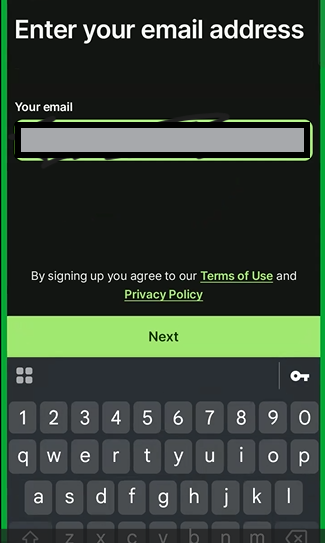 Step 4. Enter email</td>
<td align="center" width="33%"> Step 5. Email confirmation</td>
<td align="center" width="33%"> Step 6. Account type</td>
</tr>
<tr>
<td align="center" width="33%">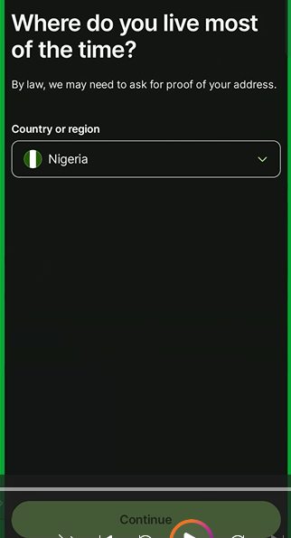 Step 7. Country of residence</td>
<td align="center" width="33%"> Step 8. What you can do with Wise in Nigeria</td>
<td align="center" width="33%">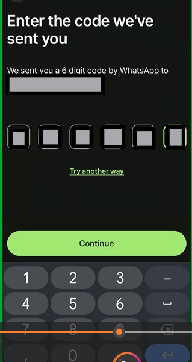 Step 9. Verification code</td>
</tr>
<tr>
<td align="center" width="33%">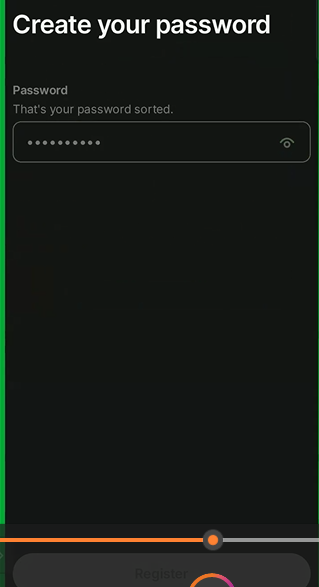 Step 10. Password, account created</td>
<td align="center" width="33%"> Step 11. Biometrics or passcode</td>
<td align="center" width="33%">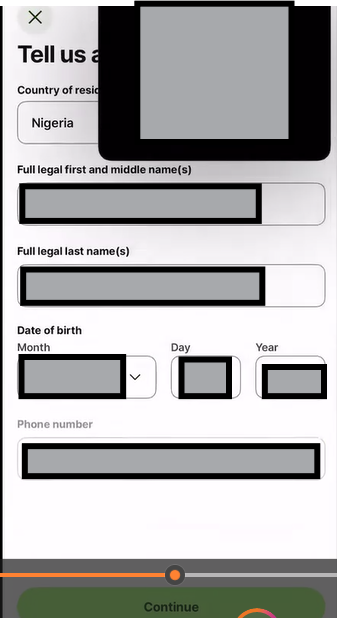 Step 12. Personal details</td>
</tr>
<tr>
<td align="center" width="33%"> Step 13. Address search</td>
<td align="center" width="33%">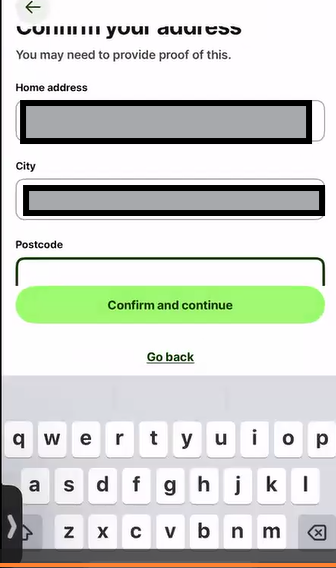 Step 14. Confirm address</td>
<td align="center" width="33%">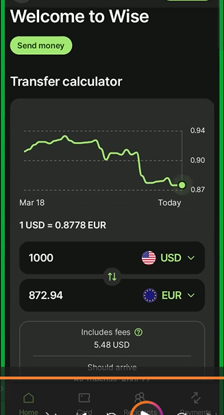 Step 15. Dashboard</td>
</tr>
<tr>
<td align="center" width="33%">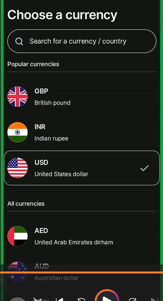 Step 16. Currency selector</td>
<td align="center" width="33%"> Step 16a. "You send" currency search</td>
<td align="center" width="33%"> Step 16b. "Recipient gets" currency list, check mark added</td>
</tr>
<tr>
<td align="center" width="33%"> Step 16bb. Transfer quote</td>
<td></td>
<td></td>
</tr>
</table>

---

*Questions or feedback on this analysis are welcome via [LinkedIn](https://www.linkedin.com/in/fortuneegbai/).*
